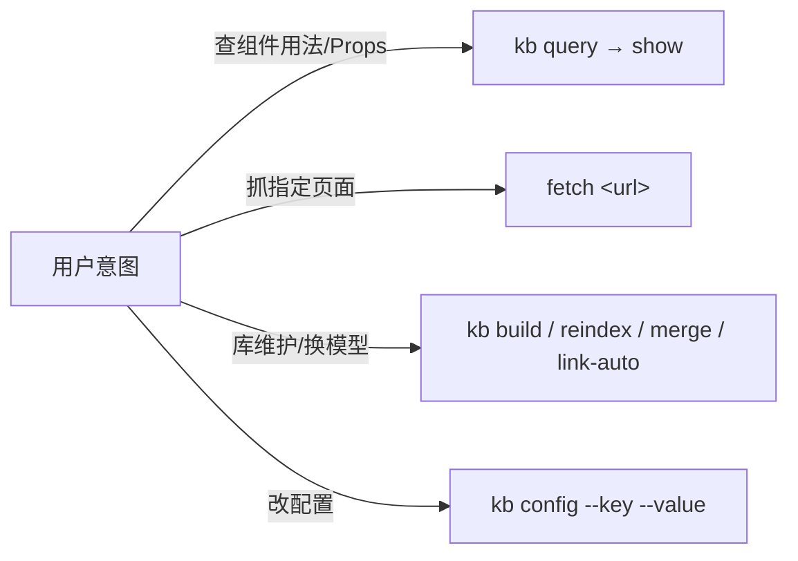

# ELEMENT-DEV — Element Plus 开发技能

> Vue 3 + Element Plus 组件库开发辅助：本地 Qdrant 知识库（kb）、element-plus.org 在线抓取（fetch）、配置管理（config）三个入口，回答"组件怎么用/Props 怎么配"。设计稿 → Element Plus 代码生成用 maliang，本 skill 只做文档知识库查询与维护。

[](https://github.com/Kirky-X/element-dev/releases)
[](LICENSE)

中文 | [English](README_EN.md)

## ✨ 功能特性

| 入口 | 说明 |
| ---- | ---- |
| `kb` | 本地 Qdrant 知识库，11 个子动作（`--help` 实测）：query / build / show / merge / reindex / update-description / update-links / link-auto / migrate-embed-model / fetch-update / config |
| `fetch` | HTTP GET 抓取 element-plus.org 静态文档页，提取 `<main>` 转 Markdown，清理 Cloudflare email-protection 痕迹，返回 `{title, url, content}` |
| `config` | 查看/修改 embed_model、db_path、context_ttl_days 等配置；`--key/--value` 按已知 schema 校验并做类型矫正，写前备份 `config.json.bak`，密钥打印掩码为 `***<末4位>`（实测 `sk-test1234abcd` → `***abcd`） |

**预构建知识库开箱即用**：仓库自带 `data/element-plus.qdrant/`（512KB，meta 实测 `doc_count: 99`），99 篇文档 = design-guide 17 + component 82，默认嵌入模型 `paraphrase-MiniLM-L3-v2`（384 维，ModelScope 下载源）。

**混合检索**：向量相似（0.7）+ BM25 关键词（0.3）融合，可选 FlashRank 重排。query 返回 300 字 `context_preview`，`kb show --id` 打印含完整 `context` 的 12 字段 payload。

**SSRF 双层防护**（`scripts/fetcher/_http.py`）：第一层 URL 校验（仅 http(s)、拒绝内网 IP 字面量、主机名白名单）；第二层 DNS 解析后校验落点 IP，且重定向每一跳都重新过白名单。

**CWD 双模式**：在 skill 根目录用 `python3 -m scripts.kb.cli`，或在任意目录（如用户的 Vue 工程）按绝对路径直接调 `scripts/kb/cli.py`——配置与库路径始终相对 skill 根定位，与 cwd 无关。`merge` 合并两库时保留 `context` 字段并校验 embed_model 一致。

## 📦 安装

```bash
# 同步到 agent 技能目录（~/.zcode/skills 与 ~/.claude/skills）
bash scripts/sync-skills.sh element-dev

# 首跑前置：安装 Python 依赖
pip install -r requirements.txt   # 必需: qdrant-client/rank-bm25/httpx/sentence-transformers/modelscope
                                  # 可选: flashrank(重排) / openai(云端嵌入)
```

缺依赖时不会裸 traceback 崩溃，会显式提示安装命令或切换云端模型（`config --key embed_model --value openai://<model>`）。

**首次使用需准备 sidebars/**（`sidebars/` 被 gitignore，clone 后不存在，`kb build` 会报 FileNotFoundError）：

```bash
bash scripts/fetch-sidebars.sh                            # 下载生成 2 个 sidebar 文件
bash scripts/fetch-sidebars.sh --dry-run                  # 离线验证
```

数据源优先级（`--source auto`）：抓取 element-plus.org 渲染后的 sidebar HTML，回落 GitHub Contents API；两路都过 SSRF 防护。

## 🚀 快速开始

```bash
cd {SKILL_DIR}

# 本地查询（预构建库，装好依赖即可查）
python3 -m scripts.kb.cli query --question "ElTable virtual scrolling" --top-k 5

# 查看单篇文档完整 payload
python3 -m scripts.kb.cli show --id <doc_id>

# 在线抓单页文档
python3 scripts/fetcher/fetch.py https://element-plus.org/zh-CN/component/button

# 换嵌入模型后全量重建
python3 -m scripts.kb.cli config --key embed_model --value sentence-transformers/all-MiniLM-L6-v2
python3 -m scripts.kb.cli build
```



## ✅ 测试与验证

实测 `python3 -m pytest tests/ scripts/ -q`：**62 passed**（tests/ 48 + scripts/kb/tests/ 14）。注意只跑 `scripts/` 只能收集到 14 个，根目录 `tests/` 必须显式传入。测试用 `FakeEmbedder`（SHA1 派生确定性向量），离线可跑。

> `tests/` 与 `sidebars/` 均被 gitignore（开发期产物不入仓库），clone 后无测试目录；预构建库 `data/element-plus.qdrant/` 例外，随仓库分发。

## 📁 目录结构

```
element-dev/
├── SKILL.md                    # 3 入口路由 + 禁止事项 + 失败模式表
├── config.json                 # kb 单一配置源（写入自动备份 .bak）
├── requirements.txt            # Python 依赖
├── data/
│   ├── element-plus.qdrant/          # 预构建 Qdrant 库（99 向量，开箱即用）
│   └── element-plus.qdrant.meta.json # 库元数据（doc_count/embed_model/content_hashes）
├── sidebars/                   # sidebar 文件（gitignore，fetch-sidebars.sh 生成）
└── scripts/
    ├── kb/                     # cli.py + query/indexer/merge/reindex/fetch_update/config 等
    ├── fetcher/                # _http.py（SSRF 双层防护）+ fetch.py
    └── fetch-sidebars.sh       # sidebar 下载入口（首次使用必跑）
```

## 🔮 边界

- 只做 Element Plus 文档知识库查询与维护；设计稿 → 代码生成属于 **maliang**
- KB 模块与 hap-dev 同源（B1-B13 修复全量继承），差异在文档源与 sidebar 格式（964 篇/9 类 vs 99 篇/2 类）
- 禁止跨模型向量空间混用（向量身份 = model+dim+source+version，build/merge/query 入口强校验）；禁止单向链接；禁止混淆 `content_hash`（元数据变更）与 `context_hash`（网页内容变更）；抓取必须清理 Cloudflare 痕迹否则 context_hash 永不稳定
- 页面正文内残留的 demo 脚手架不做清理（仅清理 Cloudflare 痕迹与 `element-plus.run/#<base64>` 演示链接）

## 📄 License 与归属

[MIT](LICENSE) © Kirky-X。完整配置字段表、失败模式表与禁止事项见 [SKILL.md](SKILL.md)。
