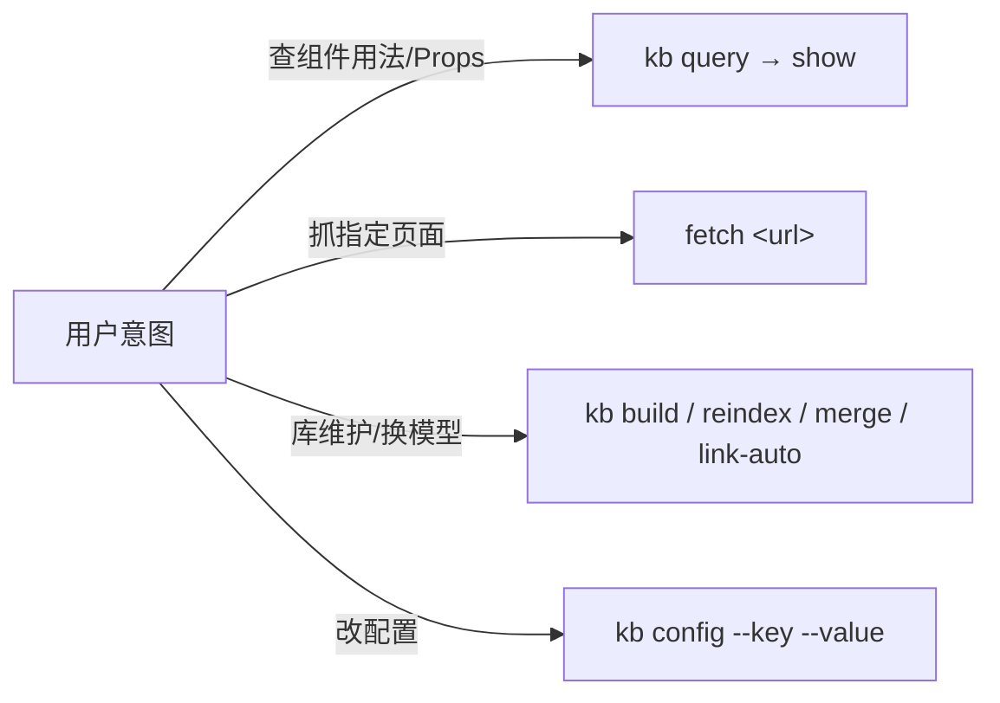

# ELEMENT-DEV — Element Plus Development Skill

> Vue 3 + Element Plus component-library development assistance: three entries — local Qdrant knowledge base (kb), element-plus.org online fetching (fetch), and config management (config) — answering "how to use a component / how to configure Props". Design-to-Element-Plus code generation belongs to maliang; this skill only does documentation knowledge-base query and maintenance.

English | [中文](README.md)

[](https://github.com/Kirky-X/element-dev/releases)
[](LICENSE)

## ✨ Features

| Entry | Description |
| ---- | ---- |
| `kb` | Local Qdrant knowledge base, 11 sub-actions (measured via `--help`): query / build / show / merge / reindex / update-description / update-links / link-auto / migrate-embed-model / fetch-update / config |
| `fetch` | HTTP GET fetches static documentation pages from element-plus.org, extracts `<main>` into Markdown, cleans Cloudflare email-protection traces, and returns `{title, url, content}` |
| `config` | Views/edits embed_model, db_path, context_ttl_days, and other settings; `--key/--value` validates against the known schema with type coercion, backs up `config.json.bak` before writing, and masks printed secrets as `***<last 4 chars>` (measured: `sk-test1234abcd` → `***abcd`) |

**Pre-built knowledge base, ready out of the box**: the repo ships `data/element-plus.qdrant/` (512KB; meta measured `doc_count: 99`); 99 documents = design-guide 17 + component 82; default embedding model `paraphrase-MiniLM-L3-v2` (384 dims, ModelScope download source).

**Hybrid retrieval**: vector similarity (0.7) fused with BM25 keywords (0.3), with optional FlashRank reranking. query returns a 300-character `context_preview`; `kb show --id` prints the 12-field payload including the full `context`.

**Two-layer SSRF protection** (`scripts/fetcher/_http.py`): layer one validates the URL (http(s) only, rejects intranet IP literals, hostname whitelist); layer two validates the resolved IP after DNS resolution, and every redirect hop re-passes the whitelist.

**Dual CWD modes**: run `python3 -m scripts.kb.cli` from the skill root, or call `scripts/kb/cli.py` directly by absolute path from any directory (e.g. the user's Vue project) — config and database paths are always resolved relative to the skill root, independent of cwd. When merging two databases, `merge` preserves the `context` field and validates that embed_model matches.

## 📦 Installation

```bash
# 同步到 agent 技能目录（~/.zcode/skills 与 ~/.claude/skills）
bash scripts/sync-skills.sh element-dev

# 首跑前置：安装 Python 依赖
pip install -r requirements.txt   # 必需: qdrant-client/rank-bm25/httpx/sentence-transformers/modelscope
                                  # 可选: flashrank(重排) / openai(云端嵌入)
```

Missing dependencies never cause a bare traceback crash: the script explicitly prints the install command or suggests switching to a cloud model (`config --key embed_model --value openai://<model>`).

**First-time use requires preparing sidebars/** (`sidebars/` is gitignored and does not exist after cloning; `kb build` raises FileNotFoundError):

```bash
bash scripts/fetch-sidebars.sh                            # 下载生成 2 个 sidebar 文件
bash scripts/fetch-sidebars.sh --dry-run                  # 离线验证
```

Data-source priority (`--source auto`): fetch the rendered sidebar HTML from element-plus.org, falling back to the GitHub Contents API; both paths go through SSRF protection.

## 🚀 Quick Start

```bash
cd {SKILL_DIR}

# 本地查询（预构建库，装好依赖即可查）
python3 -m scripts.kb.cli query --question "ElTable virtual scrolling" --top-k 5

# 查看单篇文档完整 payload
python3 -m scripts.kb.cli show --id <doc_id>

# 在线抓单页文档
python3 scripts/fetcher/fetch.py https://element-plus.org/zh-CN/component/button

# 换嵌入模型后全量重建
python3 -m scripts.kb.cli config --key embed_model --value sentence-transformers/all-MiniLM-L6-v2
python3 -m scripts.kb.cli build
```



## ✅ Tests & Verification

Measured `python3 -m pytest tests/ scripts/ -q`: **62 passed** (tests/ 48 + scripts/kb/tests/ 14). Note that running only `scripts/` collects just 14 tests; the root-level `tests/` must be passed explicitly. Tests use a `FakeEmbedder` (SHA1-derived deterministic vectors) and run offline.

> Both `tests/` and `sidebars/` are gitignored (development-time artifacts stay out of the repo), so there is no tests directory after cloning; the pre-built `data/element-plus.qdrant/` is the exception and ships with the repo.

## 📁 Directory Structure

```
element-dev/
├── SKILL.md                    # 3 入口路由 + 禁止事项 + 失败模式表
├── config.json                 # kb 单一配置源（写入自动备份 .bak）
├── requirements.txt            # Python 依赖
├── data/
│   ├── element-plus.qdrant/          # 预构建 Qdrant 库（99 向量，开箱即用）
│   └── element-plus.qdrant.meta.json # 库元数据（doc_count/embed_model/content_hashes）
├── sidebars/                   # sidebar 文件（gitignore，fetch-sidebars.sh 生成）
└── scripts/
    ├── kb/                     # cli.py + query/indexer/merge/reindex/fetch_update/config 等
    ├── fetcher/                # _http.py（SSRF 双层防护）+ fetch.py
    └── fetch-sidebars.sh       # sidebar 下载入口（首次使用必跑）
```

## 🔮 Boundaries

- Only does Element Plus documentation knowledge-base query and maintenance; design-to-code generation belongs to **maliang**
- The KB module shares its origin with hap-dev (B1-B13 fixes fully inherited); the differences are the doc source and sidebar format (964 docs/9 categories vs 99 docs/2 categories)
- Cross-model vector-space mixing is forbidden (vector identity = model+dim+source+version; the build/merge/query entry points enforce validation); one-way links are forbidden; conflating `content_hash` (metadata changes) with `context_hash` (web-page content changes) is forbidden; fetching must clean Cloudflare traces, otherwise context_hash never stabilizes
- Demo scaffolding left in page bodies is not cleaned (only Cloudflare traces and `element-plus.run/#<base64>` demo links are removed)

## 📄 License & Attribution

[MIT](LICENSE) © Kirky-X. For the full config-field table, failure-mode table, and forbidden items, see [SKILL.md](SKILL.md).
