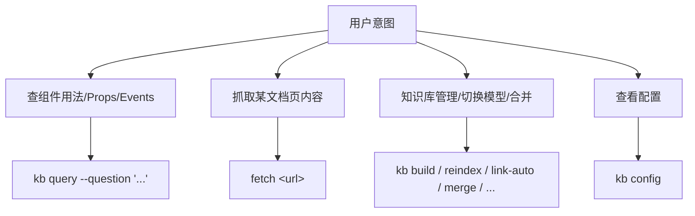

# ELEMENT-DEV —— Element Plus 开发技能

Vue 3 + Element Plus 组件库开发辅助技能。三个子命令覆盖 Element Plus 文档检索与知识管理：**kb**（本地知识库）+ **fetch**（在线抓取）+ **config**（配置管理）。

- **kb**（本地知识库）— 本地 Qdrant 知识库，2 类 sidebar 文档分类存储（design-guide 17 篇 + component 82 篇 = 99 文档），向量嵌入（默认 `paraphrase-MiniLM-L3-v2`，ModelScope/云端可切换）+ BM25 关键词索引 + 可选 FlashRank 重排。12 字段 schema（含 C1 `context`/`context_hash`）。子动作：query/build/reindex/merge/update-description/update-links/link-auto/migrate-embed-model/fetch-update/config。解决"**本地能查什么**"。
- **fetch**（在线抓取）— 直接 HTTP GET 抓取 element-plus.org 静态文档页，提取 `<main>` 内容并转 Markdown，清洗 Cloudflare email-protection artifacts。作为 kb description/links/context 填充的合法通道。解决"**网上有什么**"。
- **config**（配置）— 显示/修改 embed_model、rerank_model、db_path、context_ttl_days 等配置项。解决"**怎么切换**"。

## 与 hap-dev 的差异

| 维度 | hap-dev | element-dev |
|------|---------|-------------|
| 文档源 | HarmonyOS 搜索 API（POST + 多 catalog 路由） | element-plus.org 静态站点（HTTP GET） |
| 在线模块 | `scripts/search/{search.py, detail.py}` 双端点 | `scripts/fetcher/fetch.py` 单一 GET |
| Sidebar 格式 | `#### N.N [title](url)` | `### N.N[.] [title](url)`（3 hashes + 可选尾点） |
| 文档数 | 964（9 类） | 99（2 类：design-guide + component） |
| KB 模块 | 领域无关 | 同 hap-dev（B1-B13 修复全部继承） |

## 子命令路由



## kb 子命令

本地 Qdrant 知识库。99 文档（17 design-guide + 82 component），向量嵌入 + BM25 + 可选重排。

### kb query —— 混合检索

```bash
python3 -m scripts.kb.cli query --question "ElTable 虚拟滚动" --top-k 5
```

混合检索：向量相似度（权重 0.7）+ BM25 关键词（权重 0.3），可选 FlashRank 重排。

### kb build —— 全量构建

```bash
python3 -m scripts.kb.cli build
```

解析 2 个 sidebar 文件 → 嵌入 99 文档 → 写入 `data/element-plus.qdrant`。B11 后自动生成 `data/element-plus.qdrant.meta.json`。

### kb reindex —— 增量重建

```bash
python3 -m scripts.kb.cli reindex            # 仅 content_hash 变化的文档
python3 -m scripts.kb.cli reindex --force    # 全量强制
```

B6: 自动检测 embed_model 变化，切换模型时自动 force=True。

### kb link-auto —— 余弦 >0.9 自动双向链接

```bash
python3 -m scripts.kb.cli link-auto --threshold 0.9 --max-per-doc 10
```

### kb update-description —— 描述回填 + 向量重算

```bash
python3 -m scripts.kb.cli update-description --id <doc_id> --description "..."
```

B13: 同步更新 content_hash（B4 公式含 description）。

### kb update-links —— 手动双向链接

```bash
python3 -m scripts.kb.cli update-links --id <doc_id> --content "<markdown with 相关推荐>"
```

### kb migrate-embed-model —— 模型迁移

```bash
python3 -m scripts.kb.cli migrate-embed-model --model <model_name>
```

### kb merge —— 合并两个 DB

```bash
python3 -m scripts.kb.cli merge --db-a <path_a> --db-b <path_b> --out <out_path>
```

B3: 入口校验两 DB embed_model 一致。

### kb fetch-update —— 抓取 URL + 智能更新（C1）

```bash
# 正常调用（TTL 内不 fetch，直接用 DB 缓存）
python3 -m scripts.kb.cli fetch-update --id <doc_id>

# 强制重新 fetch（跳过 TTL 检查）
python3 -m scripts.kb.cli fetch-update --id <doc_id> --force

# 覆盖 config 中的 TTL 天数
python3 -m scripts.kb.cli fetch-update --id <doc_id> --ttl-days 7
```

C1 三层缓存策略（按优先级）：

1. **cached**（TTL 内，无 `--force`）— 不 fetch，直接返回 DB 中的 context/description/向量。
2. **refreshed**（`--force` 或 TTL 过期，fetch 后 `context_hash` 一致）— 内容未变，仅更新 `updated_at`，不重算向量。
3. **updated**（`--force` 或 TTL 过期，fetch 后 `context_hash` 不一致）— 内容已变，全量更新 `context`/`description`/`context_hash`/`content_hash`/`向量`/`updated_at`。

`context_hash = sha1(context)`，与 `content_hash`（= sha1(title+url+doc_type+description+links)，用于 reindex）职责分离：前者检测网页内容变更，后者检测元数据变更。

description 默认由 `_extractive_summary()` 抽取首段有意义内容生成（确定性回退）；可传入 LLM summarize 回调增强。

### kb config —— 配置管理

```bash
python3 -m scripts.kb.cli config
python3 -m scripts.kb.cli config --key embed_model --value sentence-transformers/all-MiniLM-L6-v2
```

## fetch 子命令

```bash
# 抓取单个文档
python3 -m scripts.fetcher.fetch https://element-plus.org/zh-CN/component/button

# 抓取后用于 update-description
python3 -c "
import sys; sys.path.insert(0, '.')
from scripts.fetcher.fetch import fetch
r = fetch('https://element-plus.org/zh-CN/component/table')
if 'error' not in r:
    desc = r['content'][:150].replace('\n', ' ').strip()
    print(desc)
"
```

返回 `{title, url, content}`，content 为 Markdown 格式。提取 `<main>` 标签内容避免导航/页脚干扰。

## 配置

`config.json` 字段：

| 字段 | 默认值 | 说明 |
|------|--------|------|
| `embed_model` | `sentence-transformers/paraphrase-MiniLM-L3-v2` | 嵌入模型 |
| `embed_dim` | `384` | 向量维度 |
| `embed_source` | `modelscope` | 模型源（modelscope/huggingface/openai） |
| `db_path` | `data/element-plus.qdrant` | Qdrant 本地 DB 路径 |
| `collection` | `element_plus_docs` | Qdrant collection 名 |
| `sidebars_dir` | `sidebars` | sidebar 文件目录 |
| `site_base` | `https://element-plus.org` | 文档站点基址 |
| `context_ttl_days` | `30` | C1: context 缓存 TTL（天），过期后 fetch 校验 hash |
| `query.default_top_k` | `5` | 默认返回 top-K |
| `query.bm25_weight` | `0.3` | BM25 权重 |
| `query.vector_weight` | `0.7` | 向量权重 |

## 失败模式

| 错误 | 原因 | 解决 |
|------|------|------|
| `embed_model mismatch` | query/merge 时 embedder 与 DB 不一致 | 用 `migrate-embed-model` 迁移或 `reindex --force` 重建 |
| `point_id collision` | 两个 doc_id 前 16 hex 重合（极罕见） | 重建 DB（urls 自然不同则 sha1 不同） |
| `unknown payload field` | set_payload 写入白名单外字段 | 检查字段名，仅 12 字段允许（含 C1 `context`/`context_hash`） |
| `set_payload: no fields to set` | 空 dict 调用 | 检查调用方传参 |
| `HTTP request failed` | fetch URL 不可达 | 检查 URL/网络/element-plus.org 可用性 |
| `keyword must not be empty` | query 空字符串 | 提供有效问题 |

## 禁止事项

1. **禁止跨模型向量空间混用** —— 向量身份 = (model_name, dim, source, version)。同维度不同模型向量空间不兼容，余弦相似度无意义。校验必须在 build/merge/query 入口触发。
2. **禁止单方向链接** —— links 是双向契约，A.links += B.id ↔ B.links += A.id。
3. **禁止吞掉错误** —— 错误必须显式抛出或返回，不允许藏在默认值背后。
4. **禁止 set_payload 写白名单外字段** —— 防止 schema 污染。
5. **禁止 char-level 分词英文** —— BM25 必须保留英文整 token（B8 修复）。
6. **禁止混淆 content_hash 与 context_hash** —— content_hash = sha1(title+url+doc_type+description+links) 用于 reindex 检测元数据变更；context_hash = sha1(context) 用于 fetch-update 检测网页内容变更。两者职责分离，不可互相替代。
7. **禁止 fetch 时不清洗 Cloudflare artifacts** —— `/cdn-cgi/l/email-protection#<random_hex>` 每次加载生成不同哈希，必须在 `extract_main_html()` 中清洗，否则 context_hash 永远不稳定（C1 修复）。

## 文档分类

| doc_type | 来源 sidebar | 文档数 | 内容 |
|----------|-------------|--------|------|
| `design-guide` | element-plus-design-guide-sidebar.md | 17 | 设计/导航/安装/快速开始/国际化/升级/主题/暗黑模式/SSR/过渡动画等 |
| `component` | element-plus-component-sidebar.md | 82 | Basic(12) + Config(1) + Form(25) + Data(23) + Navigation(9) + Feedback(10) + Others(2) |
