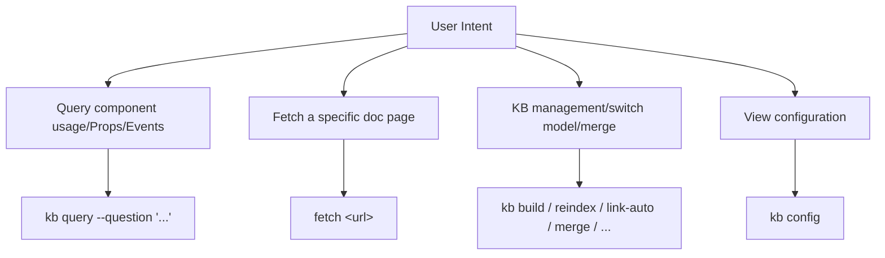

# ELEMENT-DEV — Element Plus Development Skill

Vue 3 + Element Plus component library development assistance skill. Three subcommands cover Element Plus document retrieval and knowledge management: **kb** (local knowledge base) + **fetch** (online scraping) + **config** (configuration management).

> **Boundary**: 设计稿 → Element Plus 代码生成用 maliang；本 skill 只做 Element Plus 文档知识库查询与知识库维护。

- **kb** (local knowledge base) — Local Qdrant knowledge base, 2-category sidebar document classification (design-guide 17 docs + component 82 docs = 99 documents), vector embedding (default `paraphrase-MiniLM-L3-v2`, switchable between ModelScope/cloud) + BM25 keyword indexing + optional FlashRank reranking. 12-field schema (including C1 `context`/`context_hash`). Sub-actions: query/build/show/merge/reindex/update-description/update-links/link-auto/migrate-embed-model/fetch-update/config. Answers "**what can be found locally**".
- **fetch** (online scraping) — Direct HTTP GET scraping of element-plus.org static doc pages, extracting `<main>` content and converting to Markdown, cleaning Cloudflare email-protection artifacts. Serves as a legitimate channel for kb description/links/context population. Answers "**what's available online**".
- **config** (configuration) — View/modify embed_model, rerank_model, db_path, context_ttl_days and other config items. Answers "**how to switch**".

## Differences from hap-dev

| Dimension | hap-dev | element-dev |
|------|---------|-------------|
| Doc source | HarmonyOS Search API (POST + multi-catalog routing) | element-plus.org static site (HTTP GET) |
| Online module | `scripts/search/{search.py, detail.py}` dual endpoints | `scripts/fetcher/fetch.py` single GET |
| Sidebar format | `#### N.N [title](url)` | `### N.N[.] [title](url)` (3 hashes + optional trailing period) |
| Doc count | 964 (9 categories) | 99 (2 categories: design-guide + component) |
| KB module | Domain-agnostic | Same as hap-dev (B1-B13 fixes all inherited) |

## Subcommand Routing


```mermaid
flowchart TD
    A[User Intent] --> B["Query component usage/Props/Events"]
    A --> D["Fetch a specific doc page"]
    A --> F["KB management/switch model/merge"]
    A --> H["View configuration"]

    B --> B1["kb query --question '...'"]
    D --> D1["fetch &lt;url&gt;"]
    F --> F1["kb build / reindex / link-auto / merge / ..."]
    H --> H1["kb config"]
```

## kb Subcommand

Local Qdrant knowledge base. 99 documents (17 design-guide + 82 component), vector embedding + BM25 + optional reranking.

**How to run**: all commands below assume the skill root as cwd (`cd {SKILL_DIR}` first). From any other directory (e.g. a user's Vue project), call the CLI by absolute path — it works without `python3 -m` because `cli.py` supports direct invocation and always locates `config.json`/`data/` relative to the skill root, not the cwd:

```bash
cd {SKILL_DIR} && python3 -m scripts.kb.cli query --question "ElTable virtual scrolling" --top-k 5
# or from anywhere:
python3 {SKILL_DIR}/scripts/kb/cli.py query --question "ElTable virtual scrolling" --top-k 5
```

Hybrid search: vector similarity (weight 0.7) + BM25 keywords (weight 0.3), optional FlashRank reranking. Each result carries `context_preview` (first 300 chars of the stored page content); use `kb show --id <id>` for the full `context`.

### kb build — Full Build

```bash
python3 -m scripts.kb.cli build
```

Parses 2 sidebar files → embeds 99 documents → writes to `data/element-plus.qdrant`. Auto-generates `data/element-plus.qdrant.meta.json` after B11.

### kb show — Read One Doc (Full Context)

```bash
python3 -m scripts.kb.cli show --id <doc_id>
```

Prints the complete 12-field payload including the full `context` (query only returns a 300-char `context_preview`).

### kb reindex — Incremental Rebuild

```bash
python3 -m scripts.kb.cli reindex            # only docs with changed content_hash
python3 -m scripts.kb.cli reindex --force    # force full
```

B6: auto-detects embed_model changes, automatically sets force=True when switching models.

### kb link-auto — Cosine >0.9 Automatic Bidirectional Linking

```bash
python3 -m scripts.kb.cli link-auto --threshold 0.9 --max-per-doc 10
```

### kb update-description — Description Backfill + Vector Recomputation

```bash
python3 -m scripts.kb.cli update-description --id <doc_id> --description "..."
```

B13: synchronously updates content_hash (B4 formula includes description).

### kb update-links — Manual Bidirectional Linking

```bash
python3 -m scripts.kb.cli update-links --id <doc_id> --content "<markdown with related recommendations>"
```

### kb migrate-embed-model — Model Migration

```bash
python3 -m scripts.kb.cli migrate-embed-model --model <model_name>
```

### kb merge — Merge Two DBs

```bash
python3 -m scripts.kb.cli merge --db-a <path_a> --db-b <path_b> --out <out_path>
```

B3: entry validates both DBs have the same embed_model.

### kb fetch-update — Fetch URL + Smart Update (C1)

```bash
# Normal call (within TTL, no fetch, uses DB cache directly)
python3 -m scripts.kb.cli fetch-update --id <doc_id>

# Force re-fetch (skip TTL check)
python3 -m scripts.kb.cli fetch-update --id <doc_id> --force

# Override TTL days from config
python3 -m scripts.kb.cli fetch-update --id <doc_id> --ttl-days 7
```

C1 three-layer cache strategy (by priority):

1. **cached** (within TTL, no `--force`) — no fetch, returns context/description/vector from DB directly.
2. **refreshed** (`--force` or TTL expired, fetch shows `context_hash` unchanged) — content unchanged, only updates `updated_at`, no vector recomputation.
3. **updated** (`--force` or TTL expired, fetch shows `context_hash` changed) — content changed, full update of `context`/`description`/`context_hash`/`content_hash`/`vector`/`updated_at`.

`context_hash = sha1(context)`, separated from `content_hash` (= sha1(title+url+doc_type+description+links), used for reindex) in responsibilities: the former detects webpage content changes, the latter detects metadata changes.

Description is generated by `_extractive_summary()` extracting the first meaningful paragraph by default (deterministic fallback); an LLM summarize callback can be passed for enhancement.

### kb config — Configuration Management

```bash
python3 -m scripts.kb.cli config
python3 -m scripts.kb.cli config --key embed_model --value sentence-transformers/all-MiniLM-L6-v2
```

`--key/--value` validates the key against the known schema (nested keys use dots, e.g. `query.default_top_k`) and coerces the value to the field's type; the previous `config.json` is backed up to `config.json.bak` before writing. Secrets (`embed_api_key`/`rerank_api_key`) are printed masked as `***<last4>`.

## fetch Subcommand

```bash
# Fetch a single doc (absolute path invocation works from any directory)
python3 {SKILL_DIR}/scripts/fetcher/fetch.py https://element-plus.org/zh-CN/component/button

# Fetch then use for update-description
python3 -c "
import sys; sys.path.insert(0, '{SKILL_DIR}')
from scripts.fetcher.fetch import fetch
r = fetch('https://element-plus.org/zh-CN/component/table')
if 'error' not in r:
    desc = r['content'][:150].replace('\n', ' ').strip()
    print(desc)
"
```

Returns `{title, url, content}`, where content is in Markdown format. Extracts `<main>` tag content to avoid navigation/footer interference. Known cleanup applied and limits: Cloudflare email-protection artifacts and `element-plus.run/#<base64>` demo links are stripped; any residual demo scaffolding inside page bodies is left as-is.

## Configuration

`config.json` fields:

| Field | Default value | Description |
|------|--------|------|
| `embed_model` | `sentence-transformers/paraphrase-MiniLM-L3-v2` | Embedding model |
| `embed_dim` | `384` | Vector dimension |
| `embed_source` | `modelscope` | Model source (modelscope/huggingface/openai) |
| `db_path` | `data/element-plus.qdrant` | Qdrant local DB path |
| `collection` | `element_plus_docs` | Qdrant collection name |
| `sidebars_dir` | `sidebars` | Sidebar file directory |
| `site_base` | `https://element-plus.org` | Doc site base URL |
| `context_ttl_days` | `30` | C1: context cache TTL (days), fetch verifies hash after expiry |
| `query.default_top_k` | `5` | Default top-K results |
| `query.bm25_weight` | `0.3` | BM25 weight |
| `query.vector_weight` | `0.7` | Vector weight |

## Failure Modes

| Error | Cause | Solution |
|------|------|------|
| `ModuleNotFoundError: sentence_transformers` (or `torch`) | local embedding deps not installed; query/build/reindex crash without them | `pip install sentence-transformers` (or `pip install -r requirements.txt`); or switch to a cloud model: `config --key embed_model --value openai://<model>` + set `embed_base_url`/`embed_api_key` |
| `embed_model mismatch` | embedder differs from DB during query/merge | Use `migrate-embed-model` to migrate or `reindex --force` to rebuild |
| `point_id collision` | two doc_ids have matching first 16 hex chars (extremely rare) | Rebuild DB (different urls → different sha1) |
| `unknown payload field` | set_payload writing a field outside the whitelist | Check field name, only 12 fields allowed (including C1 `context`/`context_hash`) |
| `set_payload: no fields to set` | empty dict call | Check caller arguments |
| `HTTP request failed` | fetch URL unreachable | Check URL/network/element-plus.org availability |
| `keyword must not be empty` | query empty string | Provide a valid question |

## Prohibitions

1. **No cross-model vector space mixing** — vector identity = (model_name, dim, source, version). Vectors from different models with the same dimension have incompatible vector spaces; cosine similarity is meaningless. Validation must be triggered at build/merge/query entry points.
2. **No unidirectional links** — links are a bidirectional contract: A.links += B.id ↔ B.links += A.id.
3. **No swallowing errors** — errors must be explicitly raised or returned, never hidden behind default values.
4. **No set_payload writes outside the whitelist** — prevents schema pollution.
5. **No char-level tokenization for English** — BM25 must preserve English whole tokens (B8 fix).
6. **No confusing content_hash with context_hash** — content_hash = sha1(title+url+doc_type+description+links) for reindex metadata change detection; context_hash = sha1(context) for fetch-update webpage content change detection. The two have separate responsibilities and cannot substitute each other.
7. **No fetching without cleaning Cloudflare artifacts** — `/cdn-cgi/l/email-protection#<random_hex>` generates different hashes on each page load; must be cleaned in `extract_main_html()`, otherwise context_hash is permanently unstable (C1 fix).

## Document Classification

| doc_type | Source sidebar | Doc count | Content |
|----------|-------------|--------|------|
| `design-guide` | element-plus-design-guide-sidebar.md | 17 | design/navigation/installation/quickstart/i18n/upgrades/theme/dark-mode/SSR/transitions etc. |
| `component` | element-plus-component-sidebar.md | 82 | Basic(12) + Config(1) + Form(25) + Data(23) + Navigation(9) + Feedback(10) + Others(2) |
